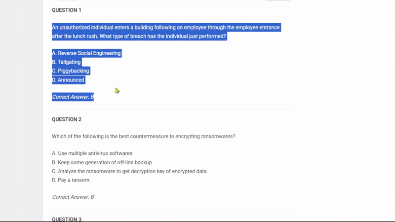

# Showanswer-AI

Showanswer-AI is a tool designed to automatically fetch answers to questions copied to your clipboard using the Gemini AI model. It monitors the clipboard for new content, sends the content to a local proxy server, retrieves the AI-generated answer, and displays it in a temporary popup window. This is intended to assist with exam preparation or quick information retrieval.

## Key Features

*   **Automatic Answer Retrieval:** Monitors the clipboard and automatically fetches answers for copied text.
*   **Gemini AI Integration:** Leverages the Gemini AI model for generating answers.
*   **Local Proxy Server:** Uses a local proxy server to bypass Content Security Policy (CSP) restrictions and facilitate communication with the Gemini API.
*   **Popup Display:** Presents the AI-generated answer in a temporary popup window near the cursor.
*   **CSP Bypass:** Includes functionality to bypass CSP restrictions, allowing the extension to access external resources.
*   **Right Click & Copy Unlock:** Aims to unlock right-click and copy functionality on websites where it is disabled.

## Installation

1.  **Clone the Repository:**
    ```bash
    git clone https://github.com/versaagonon/Showanswer-AI.git
    cd Showanswer-AI
    ```

2.  **Install Dependencies for the Proxy Server:**
    ```bash
    npm install
    ```

3.  **Run the Proxy Server:**
    ```bash
    npm start
    ```
    This will start the local proxy server on `http://localhost:3000`. Ensure this server is running in the background while using the Showanswer-AI tool.

4.  **Install Python Dependencies:**
    ```bash
    pip install tkinter pyperclip requests pyautogui
    ```

## Usage

1.  **Run the Python Script:**
    ```bash
    python showanswer.py
    ```
    This will start the clipboard monitoring process.

2.  **Copy Text:** Copy any question or text to your clipboard.

3.  **View the Answer:** A popup window will appear with the AI-generated answer. The popup will automatically close after 5 seconds.

## Tech Stack and Dependencies

*   **Python:**
    *   `tkinter`: For creating the popup window.
    *   `pyperclip`: For accessing the clipboard.
    *   `requests`: For making HTTP requests to the local proxy server.
    *   `pyautogui`: For getting cursor position and screen size.
*   **Node.js:**
    *   `express`: For creating the local proxy server.
    *   `cors`: For handling Cross-Origin Resource Sharing (CORS) issues.
    *   `node-fetch`: For making requests to the Gemini API from the proxy server.
*   **Manifest V3:**
    *   `manifest.json`: Configuration file for the Chrome extension.

## Suggested Improvements

1.  **Implement a User Interface for Configuration:** Add a graphical user interface (GUI) to configure the API endpoint, popup duration, and other settings. This would make the tool more user-friendly and customizable.

2.  **Improve Error Handling and Logging:** Enhance error handling to gracefully manage API connection issues, invalid responses, and clipboard access errors. Implement more detailed logging to aid in debugging and troubleshooting.

3.  **Add a History Feature:** Implement a history feature to store and display previously answered questions and their corresponding answers. This would allow users to review past queries and learn from the AI's responses.

## POC : 

